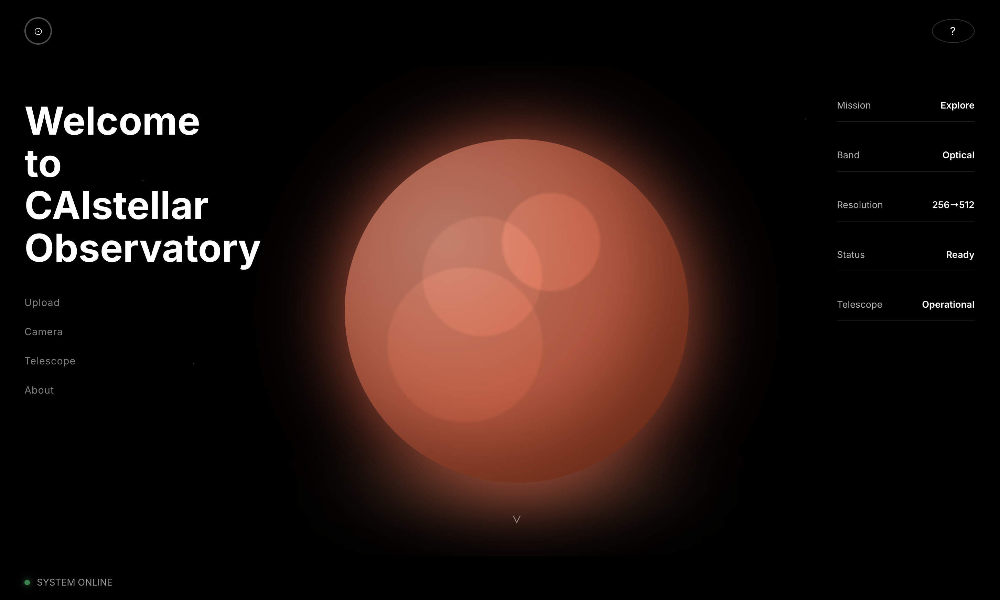

<!--
Title: AI Image Enhancement for Astronomy
Description: Deploy AI-powered resolution enhancement for telescope images using OpenShift AI on Red Hat OpenShift.
Industry: Research
Product: Red Hat OpenShift AI
Use case: Astronomical Image Processing
-->

# AI Image Enhancement for Astronomy

Deploy AI-powered resolution enhancement for telescope images using OpenShift AI on Red Hat OpenShift.



---

## Table of Contents

- [Overview](#overview)
- [Architecture](#architecture)
- [Requirements](#requirements)
- [Deploy](#deploy)
  - [Prerequisites](#prerequisites)
  - [Installation](#installation)
  - [Validation](#validation)
  - [Deletion](#deletion)
- [How It Works](#how-it-works)
- [Use Cases](#use-cases)
- [References](#references)

---

## Overview

CAIstellar Observatory brings AI image enhancement to celestial objects. This application enables users to upload telescope images, select celestial objects, and enhance them from 256×256 to 512×512 resolution using the SwinIR deep learning model running on Red Hat OpenShift AI.

---

## Architecture

```
┌──────────────┐
│  Telescope/  │  Upload astronomical image
│   Camera     │  (JPG/PNG, any size)
└──────┬───────┘
       │
       ▼
┌─────────────────────────────────────────────────────────────────┐
│  Frontend (React)                                               │
│  • Space-themed UI                                              │
│  • Drag-and-drop selection box (256x256 region)                │
│  • Mouse wheel zoom for detail inspection                      │
│  • Before/after comparison view                                │
└──────┬──────────────────────────────────────────────────────────┘
       │ REST API
       ▼
┌─────────────────────────────────────────────────────────────────┐
│  Backend (FastAPI + Python)                                     │
│  • Image preprocessing with python                              │
│  • Crop 256x256 region based on selection                      │
│  • Convert to normalized tensor format                         │
│  • Handle KServe v2 protocol communication                     │
└──────┬──────────────────────────────────────────────────────────┘
       │ KServe v2 Protocol
       ▼
┌─────────────────────────────────────────────────────────────────┐
│  OpenShift AI - Model Serving                                   │
│  ┌───────────────────────────────────────────────────────────┐ │
│  │  MLServer Runtime (ONNX Backend)                          │ │
│  │  ┌─────────────────────────────────────────────────────┐ │ │
│  │  │  SwinIR Model                                       │ │ │
│  │  │  • Input: 256×256 RGB tensor                       │ │ │
│  │  │  • Swin Transformer architecture                   │ │ │
│  │  │  • Output: 1024×1024 enhanced image (4× upscale)   │ │ │
│  │  └─────────────────────────────────────────────────────┘ │ │
│  └───────────────────────────────────────────────────────────┘ │
└──────┬──────────────────────────────────────────────────────────┘
       │
       ▼
┌─────────────────────────────────────────────────────────────────┐
│  Enhanced Image Display                                         │
│  • Receive 1024×1024 enhanced image                            │
│  • Display at 512×512 for optimal viewing                      │
│  • Side-by-side comparison with original                       │
└─────────────────────────────────────────────────────────────────┘
```

The application consists of three containerized components deployed on OpenShift:

1. **Frontend (React)**: Web interface with image upload, drag-and-drop selection box, and zoom controls
2. **Backend (FastAPI)**: Image preprocessing, crop extraction, and tensor conversion for model inference
3. **Model Server (OpenShift AI)**: SwinIR ONNX model served via MLServer with KServe v2 protocol for 4× super-resolution enhancement

Users upload telescope images, select a 256×256 region of interest, and the AI model upscales it to 1024×1024 (displayed at 512×512 for optimal viewing).

---

## Requirements

### Hardware

- **CPU**: 3 cores minimum
  - Frontend: 250 millicores request, 500 millicores limit
  - Backend: 500 millicores request, 1 core limit
  - Model Server: 2 cores request, 4 cores limit
- **Memory**: 5 GiB minimum
  - Frontend: 256 MiB request, 512 MiB limit
  - Backend: 512 MiB request, 1 GiB limit
  - Model Server: 4 GiB request, 8 GiB limit
- **GPU**: Not required (CPU-only inference supported, ~30-60 seconds per image)

### Prerequisites

- **OpenShift**: 4.2x 
- **OpenShift AI**: 3.x
- **Helm**: 3.10 or later
- **oc CLI**: 4.12 or later

### User Permissions

- Ability to create projects/namespaces
- Ability to deploy workloads (Deployments, Services, Routes)
- Ability to create InferenceService resources (for OpenShift AI model serving)
- Ability to create ServingRuntime resources

---

## Deploy


### Installation

1. **Clone this repository**:
   ```bash
   git clone https://github.com/rh-ai-quickstart/caistellar-observatory.git
   cd caistellar-observatory
   ```

2. **Create a namespace**:
   ```bash
   oc new-project caistellar-observatory
   ```

3. **Deploy the application using Helm**:
   ```bash
   helm install caistellar ./chart \
     --namespace caistellar-observatory \
     --set model.deploy=true
   ```

4. **Wait for all pods to be ready** (this may take 2-3 minutes):
   ```bash
   oc get pods -n caistellar-observatory -w
   ```

5. **Get the application URL**:
   ```bash
   oc get route caistellar -n caistellar-observatory -o jsonpath='{.spec.host}'
   ```

### Validation

1. **Check that all pods are running**:
   ```bash
   oc get pods -n caistellar-observatory
   ```
   
   Expected output showing 3 running pods:
   ```
   NAME                                      READY   STATUS    RESTARTS   AGE
   caistellar-backend-xxxxxxxxx-xxxxx        1/1     Running   0          2m
   caistellar-frontend-xxxxxxxxx-xxxxx       1/1     Running   0          2m
   caistellar-predictor-xxxxxxxxx-xxxxx      2/2     Running   0          2m
   ```

2. **Verify the model server is ready**:
   ```bash
   oc get inferenceservice -n caistellar-observatory
   ```
   
   The `READY` column should show `True`.

3. **Access the application**:
   - Open the route URL from step 5 of Installation in your web browser
   - You should see the CAIstellar Observatory interface with a space-themed UI
   - Upload a test image or use your webcam to capture an image
   - Drag the selection box over a region and click "ENHANCE"
   - The enhanced image should appear within 30-60 seconds

### Deletion

To completely remove the application:

```bash
helm uninstall caistellar -n caistellar-observatory
oc delete project caistellar-observatory
```

---

## How It Works

1. **Upload**: Load a telescope image (JPG/PNG) or capture from a connected camera
2. **Select**: Drag the selection box over your target celestial object (galaxy, nebula, planet)
3. **Zoom**: Use mouse wheel to examine the pixelated details in the original image
4. **Enhance**: Click ENHANCE
   - Backend extracts the selected 256×256 region
   - Image is converted to a normalized tensor
   - SwinIR model processes it to 1024×1024 (4× upscaling)
   - Enhanced image is displayed at 512×512 for optimal viewing
5. **Compare**: View before and after side-by-side to see revealed details

Processing time: ~30-60 seconds per image on CPU.

---

## Use Cases

### Amateur Astronomy
Apply AI-based upscaling to telescope observations. Experiment with enhancing regions of interest in planetary images, galaxies, and nebulae captured with backyard equipment.

### Education & Demonstration
Demonstrate AI image processing techniques in astronomy courses. Show students how deep learning models can be applied to astronomical image data and explore the capabilities and limitations of AI-based enhancement.

### Research & Experimentation
Test AI upscaling on archival astronomical images or legacy telescope data. Useful for exploring how modern AI models handle different types of astronomical imagery and image quality conditions.

---

## References

- [SwinIR Model Paper](https://arxiv.org/abs/2108.10257) - Liang et al., 2021
- [OpenShift AI Documentation](https://docs.redhat.com/en/documentation/red_hat_openshift_ai_self-managed)
- [KServe Documentation](https://kserve.github.io/website/)
- [MLServer Documentation](https://mlserver.readthedocs.io/)
- [Astrophotography Guide](https://en.wikipedia.org/wiki/Astrophotography)

---

## License

MIT License - See [LICENSE](LICENSE) file

---

## Credits

- **Built by**: Red Hat CAI Team
- **Powered by**: Red Hat OpenShift AI
- **Model**: SwinIR by Jingyun Liang et al.
- **Base Images**: Red Hat Universal Base Image 9 (UBI9)

---

**Clear skies and sharp images! 🌌**
